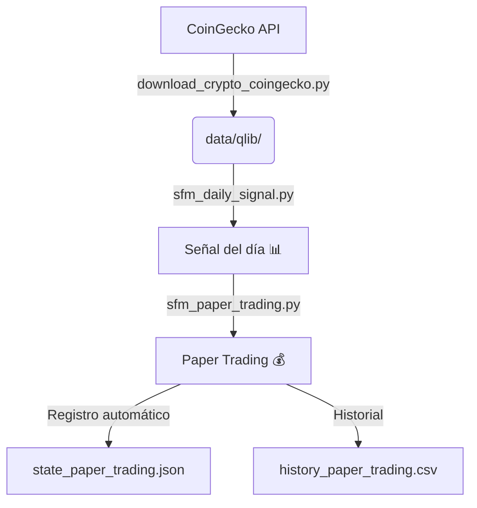

# 📋 Estado del Proyecto Qlib

> **Última actualización:** 1 Septiembre 2026
> **Repo:** `tonirodriguez/qlib` (fork de microsoft/qlib)
> **Contexto:** Fork personal de Microsoft Qlib para desarrollar estrategias de inversión cuantitativa con IA.

---

## 🧭 ¿Qué es este repositorio?

Fork personal (`tonirodriguez/qlib`) del [Microsoft Qlib](https://github.com/microsoft/qlib), una plataforma cuantitativa open-source para inversión sistemática con IA. Se utiliza para desarrollar estrategias de trading automatizadas en mercado chino (CSI300), USA (S&P 500) y criptomonedas (SFM).

---

## 🚀 Hito alcanzado: SFM v8 — Señal Diaria Operativa

El modelo **SFM v8** ha completado su ciclo de investigación y está en fase de **paper trading** con señal diaria automática.

### Resultados del modelo

| Métrica | v7 ❌ | **v8** 🚀 |
|---------|:----:|:---------:|
| **Sharpe test medio** | −1.03 | **+2.17** |
| **Equity test media** | 0.02x (−98%) | **10.49x (+949%)** |
| **Direction Accuracy** | — | **58.1%** |
| **Mejor equity** | 0.05x | **20.03x** 🏆 |
| **Mejor Sharpe** | — | **2.74** |

### Pipeline diario funcionando

| Componente | Archivo | Estado |
|------------|---------|:------:|
| **Señal diaria** | `work/crypto/sfm_daily_signal.py` | ✅ Genera predicción cada día |
| **Paper trading** | `work/crypto/sfm_paper_trading.py` | ✅ Simula operaciones automáticamente |
| **Pipeline automatizado** | `work/crypto/run_daily_pipeline.sh` | ✅ Script wrapper listo (pendiente cronjob) |
| **Actualización datos** | `work/crypto/download_crypto_coingecko.py` | ✅ Descarga desde CoinGecko |
| **Cronjob automático** | `crontab -e` → `0 9 * * * ...run_daily_pipeline.sh` | ⏳ Pendiente de permisos |

### Flujo diario (manual hasta configurar cron)

```bash
cd /mnt/c/Users/trodriguez/src/qlib
conda run -n qlib python work/crypto/download_crypto_coingecko.py   # ~5 min
conda run -n qlib python work/crypto/sfm_daily_signal.py            # ~1 min
conda run -n qlib python work/crypto/sfm_paper_trading.py           # ~30s
```

---

## ✅ Lo que funciona / está completado

### 🇨🇳 Mercado Chino (CSI300) — LightGBM + alpha158

| Experimento | Label | TopK | Ann Return | Rank IC |
|------------|:-----:|:----:|:----------:|:------:|
| Baseline | 1d | 50 | 14.73% | 0.0487 |
| Label 5d | 5d | 50 | 20.52% | 0.0793 |
| SoftTopk20 | 1d | 20 | **31.40%** | 0.0495 |

- **Periodo:** Train 2008-2014 / Valid 2015-2016 / Test 2017-2020
- **Modelo:** LightGBM con alpha158

### 🇺🇸 Mercado USA (S&P 500)

| Experimento | Estado |
|------------|:------:|
| SP500 Baseline alpha158 | ⏳ Config listo, no ejecutado |

### 🔮 Mercado Crypto — SFM (Stochastic Factor Model) ✅ COMPLETADO

| Versión | Mejora clave | Sharpe Test | Equity Test |
|:-------:|-------------|:-----------:|:-----------:|
| **v1** | SFM básico multivariable | — | — |
| **v2** | +Denoising Wavelet + Early stopping | — | — |
| **v3** | +Optuna 30 trials + MedianPruner | — | — |
| **v4** | +Walk-Forward + Top-K + Semillas fijas | **+1.24** | **1.46x** |
| **v5** | Adaptado a SP500 | +0.51 | 1.43x |
| **v6** | +Features extendidos (sin walk-forward) | −0.67 | 0.22x |
| **v7** | +Label 5d (ruido, sobreajuste) | −1.03 | 0.02x |
| **v8** | **Label 1d + Denoising + Walk-Forward + Métrica anti-overfitting** | **+2.17** | **10.49x** |

### 🧪 Otras configs

| Config | Estado |
|--------|:------:|
| alpha360 (más features) | ⏳ Config lista, no ejecutada |
| SP500 US label5d | ⏳ Config lista, no ejecutado |

---

## 📁 Archivos del proyecto (estructura)

### 📂 `work/crypto/` — Pipeline SFM (criptomonedas)

| Archivo | Descripción | Versión |
|---------|-------------|:-------:|
| `qlib_sfm_pipeline.v2.py` | Denoising + early stopping | v2 |
| `qlib_sfm_pipeline.v3.py` | Optuna 30 trials | v3 |
| `qlib_sfm_pipeline.v4.py` | Walk-Forward + Top-K + 100 trials | v4 |
| `qlib_sfm_pipeline.v5.py` | Adaptado a SP500 | v5 |
| `qlib_sfm_pipeline.v7.py` | Label 5d (fracaso) | v7 |
| `qlib_sfm_pipeline.v8.py` | **Modelo definitivo** | **v8** 🚀 |
| `sfm_daily_signal.py` | **Señal diaria en producción** | **✅ Activo** |
| `sfm_paper_trading.py` | **Paper trading automático** | **✅ Activo** |
| `run_daily_pipeline.sh` | **Pipeline completo (wrapper)** | **✅ Listo** |
| `download_crypto_coingecko.py` | Descarga datos CoinGecko | ✅ Activo |
| `research_utils.py` | Utilidades de evaluación | Compartido |

### 📂 `work/crypto/output/sfm_v8/` — Outputs de v8

| Archivo | Descripción |
|---------|-------------|
| `study_results.json` | Resultados de Optuna (100 trials) |
| `top_k_results.json` | Top-5 evaluados en test |
| `sfm_top3.pth` | **Mejor modelo** (Sharpe 2.74, Equity 20.03x) |
| `sfm_top1.pth` a `sfm_top5.pth` | Modelos del Top-5 |
| `wf_t{1-3}_w{1-2}.pth` | Modelos walk-forward |
| `scaler.pkl` | Scaler para normalizar datos |
| `signal_YYYY-MM-DD.json` | Señal diaria del día |
| `state_paper_trading.json` | Estado del paper trading |
| `history_paper_trading.csv` | Historial de operaciones |
| `optuna_distribution.png` | Distribución del objetivo Optuna |
| `top_k_results.png` | Resultados Top-5 |
| `walk_forward.png` | Walk-forward por ventana |
| `walk_forward_equity.png` | Curvas de equity walk-forward |

### 📂 `work/estrategias/` — Estrategias de momentum y PEAD

| Archivo | Descripción |
|---------|-------------|
| `momentum_backtest.py` | Backtest momentum 120d sobre SP500 |
| `momentum_pead_backtest.py` | Backtest PEAD |
| `momentum_purgedcv.py` | Purged cross-validation para momentum |
| `pead_faseA.py` | PEAD Fase A |
| `simulation/simulate.py` | Paper trading momentum 120d |
| `simulation/simulate_pead.py` | Paper trading PEAD |
| `tech_experiment.yml` a `v5.yml` | Experimentos con tecnológicas |

### 📂 `work/formacion/` — Documentación

| Archivo | Descripción |
|---------|-------------|
| `04 Experiments/ROADMAP TRABAJO.md` | **Plan hacia producción** (actualizado) |
| `01 Literature/formacion/qlib/sfm-comparativa-scripts.md` | Evolución v1→v8 |
| `01 Literature/formacion/qlib/sfm-v8-resultados.md` | Reporte completo de v8 |
| `01 Literature/formacion/qlib/Estrategia Qlib 7 SFM v8.md` | Diseño de v8 |
| `01 Literature/formacion/qlib/sfm-pipeline-qlib.md` | Pipeline básico |

---

## 🎯 Plan hacia producción

### Fase 0 — Señal Diaria (Inmediata) ✅

| # | Tarea | Estado |
|:-:|-------|:------:|
| 1 | 🔴 Script de señal diaria (`sfm_daily_signal.py`) | ✅ **HECHO** |
| 2 | 🔴 Script de actualización de datos (`download_crypto_coingecko.py`) | ✅ **HECHO** |
| 3 | 🟡 Configurar cronjob automático | ⏳ Pendiente |
| 4 | 🟡 Notificación de señal (email/Telegram) | ⏳ Pendiente |

### Fase 1 — Robustecimiento (1-2 semanas)

| # | Tarea | Estado |
|:-:|-------|:------:|
| 5 | 🟡 Ensemble de Top-3 modelos | ⏳ Pendiente |
| 6 | 🟡 Paper trading automático | ✅ **HECHO** |
| 7 | 🟢 Dashboard Streamlit | ⏳ Pendiente |
| 8 | 🟢 Alertas de decaimiento | ⏳ Pendiente |

### Fase 2 — Diversificación (2-4 semanas)

| # | Tarea | Estado |
|:-:|-------|:------:|
| 9 | 🟡 Extender a más criptos (BNB, DOT, AVAX) | ⏳ Pendiente |
| 10 | 🟡 Reentrenamiento automático mensual | ⏳ Pendiente |
| 11 | 🟢 Probar SP500 US baseline | ⏳ Pendiente |

---

## ⚠️ Problemas conocidos

| Problema | Impacto | Estado |
|----------|:-------:|:------:|
| **Datos US corruptos** (NaN en bins, 2026-03-03) | Alto — bloquea backtesting US | 🟡 Scripts de fix creados, rebuild funcional |
| **Rutas absolutas a otra máquina** (`/home/toni/`, `/mnt/c/`) | Medio — impide ejecución directa en Hermes | 🟡 Documentado en `Cambios_Qlib.md`, NO modificar |
| **Datos crypto hasta 2026-08-30** | Bajo — necesita actualización diaria | 🟢 `download_crypto_coingecko.py` listo |

---

## 📊 Resumen ejecutivo

El proyecto ha completado la fase de investigación del modelo **SFM v8** con resultados sólidos (Sharpe +2.17, Equity 10.49x). La señal diaria está operativa y el paper trading registra automáticamente las operaciones. El siguiente paso crítico es **automatizar el flujo diario con un cronjob** y **añadir notificaciones**.



---

*Documento de referencia del proyecto. Se actualiza con cada hito completado.*
*Última revisión: 1 Septiembre 2026 — SFM v8 en paper trading*