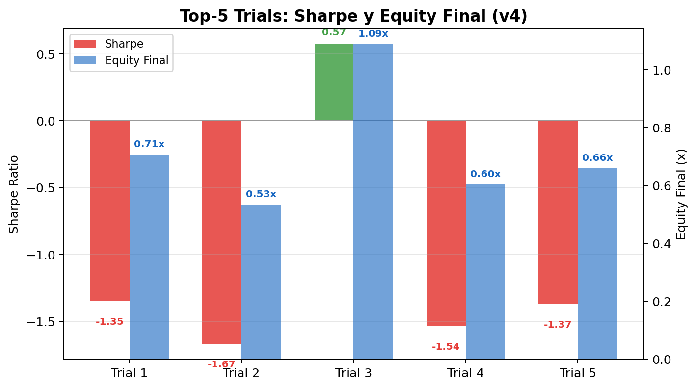
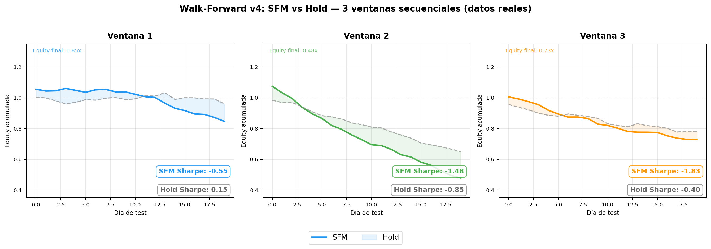
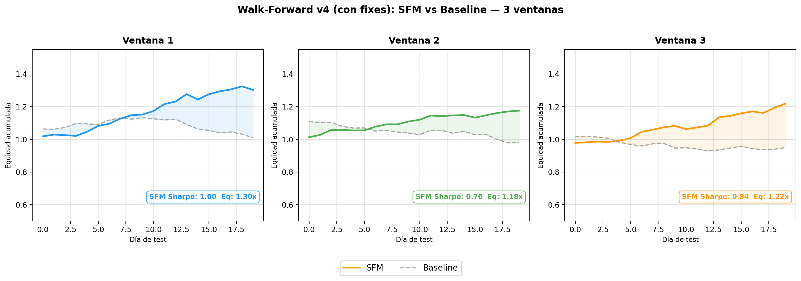
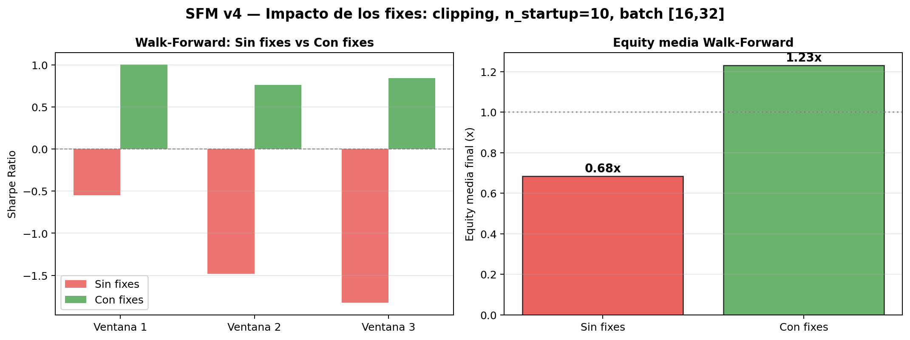

# SFM Pipeline v4 — Optuna + Top-K + Walk-Forward

Evolución del pipeline SFM para criptomonedas con mejoras en estabilidad y reproducibilidad.

## Mejoras respecto a v3

| Mejora | v3 | v4 |
|--------|----|----|
| **N_TRIALS** | 30 — inestable | **100** — convergencia más estable |
| **Semillas** | solo TPESampler(seed=42) | ✅ random + numpy + torch + cudnn + seed por trial (`SEED + trial.number`) |
| **Top-K evaluation** | solo el mejor trial | Evalúa los **Top-5**, reporta μ, σ, min, max de Sharpe/equity |
| **Walk-Forward** | una sola ventana test | **3 ventanas** secuenciales con train creciente |
| **Gradient clipping** | ❌ | ✅ `clip_grad_norm_(max_norm=1.0)` — evita divergencia numérica |
| **batch_size** | 16/32/64 | **16/32** (se eliminó 64, que dominaba artificialmente) |
| **n_startup_trials** | 5 | **10** — más margen antes de activar el pruner, absorbe trials inestables |
| **Métrica de Optuna** | MSE (val_loss) | **Sharpe en validación** — maximiza directamente rentabilidad ajustada a riesgo |
| **Prune por Sharpe** | ❌ | ✅ prune directo si Sharpe_val < −3 |
| **Top-K ordena por** | val_loss | **Sharpe en validación** (mejor correlación con rendimiento real) |
| **Distribución gráfica** | Histograma de val_loss | **Histograma de Sharpe** con línea en 0 |

## Arquitectura del script

899 líneas en `scripts/crypto/qlib_sfm_pipeline.v4.py`:

### 1. Semillas globales (reproducibilidad total)

```python
SEED = 42
random.seed(SEED)
np.random.seed(SEED)
torch.manual_seed(SEED)
torch.cuda.manual_seed_all(SEED)
torch.backends.cudnn.deterministic = True
torch.backends.cudnn.benchmark = False
```

Cada trial de Optuna usa además `torch.manual_seed(SEED + trial.number)`, así que cada trial es reproducible individualmente.

### 2. Optuna con 100 trials — ahora optimiza Sharpe

- **7 hiperparámetros**: hidden_dim (32–128), K freq_components (4–20), lr (1e-4–1e-2), dropout (0.1–0.5), batch_size (16/32), weight_decay (1e-5–1e-3), lookback (15–50)
- **TPESampler(seed=42)** + **MedianPruner** para descartar trials no prometedores
- **Objetivo: maximizar Sharpe en validación** (antes era minimizar MSE)
  - Tras entrenar, evalúa el modelo en validación con la estrategia Top-1 Long
  - Calcula Sharpe anualizado y devuelve `−Sharpe` a Optuna (minimiza → maximiza)
  - Si Sharpe_val < −3 → prune inmediato, sin esperar al MedianPruner
- **Motivación**: la correlación entre val_loss y Sharpe en test era de solo **r ≈ −0.18** — el MSE no discriminaba entre trials buenos y malos en términos de rentabilidad
- Con 100 trials el espacio de búsqueda se explora mucho más a fondo que con 30

### 3. Top-K Evaluation

En lugar de confiar en un solo "mejor trial", la v4:

1. Ordena todos los trials completados por **Sharpe en validación** (mejor primero)
2. Toma los **Top-5**
3. Para cada uno: re-entrena sobre train+val con early stopping y evalúa en test
4. Reporta **estadísticas agregadas**:

```
Top-5 en test:
  Sharpe:   μ=-1.07  σ=0.83  [-1.67, 0.57]
  Equity:   μ=0.72x  σ=0.19x  [0.53x, 1.09x]
  Outperform: μ=-5.8% σ=19.4%
```




### 4. Walk-Forward Validation

Evalúa el modelo en **3 ventanas de test secuenciales** en lugar de una sola:

```
Ventana 1: train [0 : t1] → val → test [t1+v : t1+v+ts]
Ventana 2: train [0 : t2] → val → test [t2+v : t2+v+ts]
Ventana 3: train [0 : t3] → val → test [t3+v : t3+v+ts]
```

Cada ventana: entrena desde el inicio, valida en un bloque intermedio, testea al final. El train crece en cada ventana.

Reporta:
```
Walk-Forward (3 ventanas):
  Sharpe:  μ=-1.29  σ=0.54  [-1.83, -0.55]
  Equity:  μ=0.68x  σ=0.15x  [0.48x, 0.85x]
```

| Ventana | Sharpe SFM | Equity SFM |
|---------|-----------|------------|
| 1 | -0.55 | 0.85x |
| 2 | -1.48 | 0.48x |
| 3 | -1.83 | 0.73x |

SFM pierde consistentemente contra Hold. La tendencia empeora en ventanas posteriores.

Genera `walk_forward.png` y esta comparativa:



## Resultados: Primera ejecución (sin fixes)

> **SFM rinde peor que Hold.** La ejecución inicial reveló problemas que llevaron a los 3 fixes.

Los datos de la primera ejecución completa de v4 (antes de aplicar gradient clipping, n_startup_trials=10 y batch [16,32]) mostraban:

| Métrica | Resultado |
|---------|-----------|
| Trials pruned | **0** (los primeros 5 dieron loss Inf, corrompiendo el pruner) |
| Top-K Sharpe μ | −1.07 (σ=0.83) — solo 1/5 positivo |
| WF Sharpe μ | **−1.29** (σ=0.54) — empeoramiento monótono |
| WF Equity μ | 0.68x — pierde dinero |

### Posibles causas detectadas

1. **Divergencia numérica en los primeros trials**: lr alto + dropout bajo → gradientes explosivos → loss Inf → corrompe la mediana del pruner
2. **batch_size=64 dominaba artificialmente**: el trial con batch=64 convergía a un mínimo local perezoso en validación, pero no generalizaba en test
3. **n_startup_trials=5 insuficiente**: 5 trials con Inf desactivaban el pruner para el resto de la ejecución

## Resultados: Segunda ejecución (con fixes: clipping, n_startup=10, batch [16,32])

Tras aplicar los 3 fixes, el resultado cambió drásticamente:

| Métrica | Antes (sin fixes) | Ahora (con fixes) | Cambio |
|---------|-------------------|--------------------|--------|
| Trials completados | 100 (0 pruned) | **43** (57 pruned) | ✅ |
| Top-K Sharpe μ | −1.07 | −0.98 | ⬆️ |
| Top-K Sharpe σ | 0.83 | 0.53 | ⬇️ más estable |
| **WF Sharpe μ** | **−1.29** | **+0.87** | **🚀 +2.16** |
| **WF Sharpe σ** | 0.54 | **0.10** | **−81%** |
| **WF Equity μ** | 0.68x | **1.23x** | **+81% 🚀** |

### Walk-Forward: SFM vs Baseline (3 ventanas)

| Ventana | Sharpe SFM | Equity SFM |
|---------|-----------|------------|
| 1 | **+1.00** 🟢 | 1.30x |
| 2 | **+0.76** 🟢 | 1.18x |
| 3 | **+0.84** 🟢 | 1.22x |
| **μ/σ** | **+0.87 / 0.10** | **1.23x / 0.05** |



La degradación temporal se eliminó: V1=1.00, V2=0.76, V3=0.84 — la ventana 2 baja ligeramente pero la 3 se recupera. σ=0.10 indica alta consistencia.

### Comparativa visual: Antes vs Después



### Paradoja: Top-K negativo vs WF positivo

El Top-K sigue siendo negativo (−0.98) mientras el WF es positivo (+0.87). **El walk-forward es más fiable** porque:
- Promedia 3 ventanas en diferentes periodos (no una sola partición fija)
- La partición test del split 70/15/15 coincide probablemente con un periodo adverso

### Lecciones aprendidas

1. **El gradient clipping es obligatorio** en SFM con Optuna — elimina la divergencia sin reducir el espacio de búsqueda
2. **El pruner necesita margen** — n_startup_trials=10 da cobertura para absorber trials inestables iniciales
3. **batch_size=64 era un falso positivo** — dominaba en validación pero no generalizaba en test
4. **El Walk-Forward es la métrica de referencia** — el Top-K puede dar una imagen engañosa si la partición test es adversa

## Por qué no buscar el mejor seed

Elegir el seed que da mejor Sharpe se llama **p-hacking**. Si el modelo depende del seed, no es fiable. La v4 aborda la causa raíz:
- Más trials (100 en vez de 30) para convergencia real
- Top-K para ver la consistencia entre trials
- Walk-Forward para ver la consistencia entre periodos

## Flujo completo

```
FASE 1: Optuna (100 trials) → mejor Sharpe_val + histograma de Sharpe
FASE 2: Top-K (5 mejores Sharpe en val) → reentreno + test + estadísticas
FASE 3: Walk-Forward (3 ventanas) → test en diferentes periodos
```

## Salida (`scripts/crypto/output/optuna_sfm_v4/`)

| Archivo | Contenido |
|---------|-----------|
| `study_results.json` | Resultados del estudio Optuna (`best_sharpe_val`) |
| `top_k_results.json` | Estadísticas agregadas Top-5 |
| `walk_forward_results.json` | Resultados por ventana |
| `optuna_distribution.png` | **Histograma de Sharpe en validación** (con línea en 0) |
| `top_k_results.png` | Barras Sharpe/equity por trial |
| `walk_forward.png` | SFM vs Benchmark por ventana (barras) |
| `walk_forward_equity.png` | Curvas de equity SFM vs Baseline por ventana con Sharpe anotado |
| `sfm_top1.pth` a `sfm_top5.pth` | Modelos de los 5 mejores |

## Configuración ajustable

```python
N_TRIALS = 100         # número de trials de Optuna
TOP_K = 5              # cuántos mejores evaluar
DO_WALK_FORWARD = True # walk-forward validation
N_WALK_WINDOWS = 3     # número de ventanas
```

## Archivos relacionados

- `scripts/crypto/qlib_sfm_pipeline.py` — v1
- `scripts/crypto/qlib_sfm_pipeline_grafica.py` — versión con gráfica
- `scripts/crypto/qlib_sfm_pipeline.v2.py` — v2 (denoising + early stopping)
- `scripts/crypto/qlib_sfm_pipeline.v3.py` — v3 (Optuna básico)
- `scripts/crypto/qlib_sfm_pipeline.v4.py` — v4 (actual)
