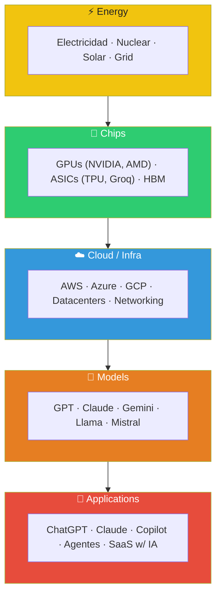
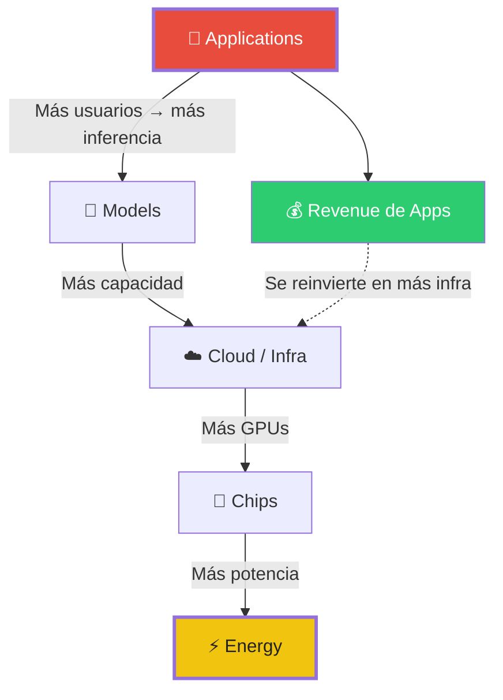
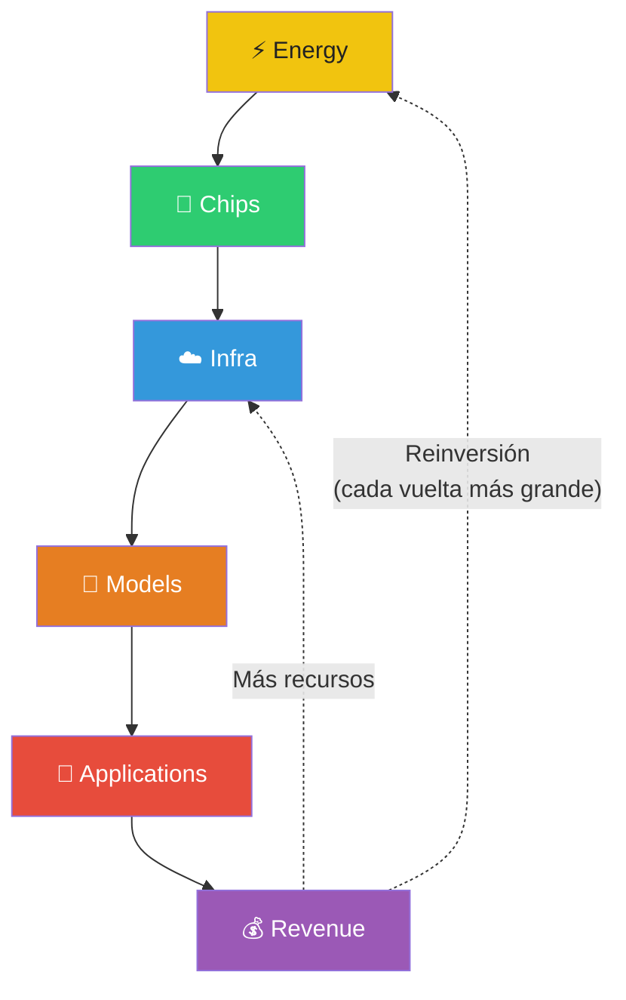
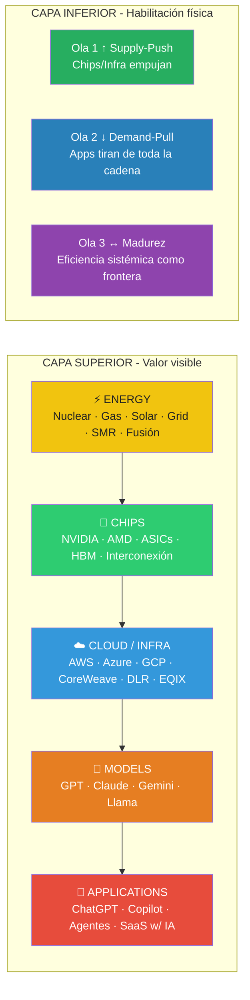

# Ciclo de Inversión en IA — Modelo de las 5 Capas (Jensen Huang / Framework Ampliado)

> **Propósito:** Framework conceptual para entender el flujo de capital, valor y cuellos de botella en la cadena vertical de la inteligencia artificial.
>
> **Origen:** Inspirado en el modelo de Jensen Huang (NVIDIA) sobre el ciclo de inversión en IA. Expandido con observaciones macro, de mercado y tecnológicas.

---

## 1. Las 5 Capas de la Cadena Vertical



**Principio fundamental:** El flujo de capital y valor viaja **de abajo arriba** en la ola inicial, y **de arriba abajo** en las olas siguientes. Pero no es un círculo — es una **espiral ascendente**.

---

## 2. Ola 1: Supply-Push (2023–2025)

> **Lema:** "Construye y ellos vendrán"
> **Carácter:** Habilitación desde la base.
> **Flujo:**
>
> ```mermaid
> flowchart LR
>     Energy["⚡ Energy"] --> Chips["💾 Chips"] --> Infra["☁️ Cloud / Infra"] --> Models["🧠 Models"] --> Apps["📱 Applications"]
>
>     style Energy fill:#f1c40f,color:#222
>     style Chips fill:#2ecc71,color:#fff
>     style Infra fill:#3498db,color:#fff
>     style Models fill:#e67e22,color:#fff
>     style Apps fill:#e74c3c,color:#fff
> ```

### Descripción

En esta primera ola, la IA todavía está siendo *habilitada*. No hay suficientes GPUs, no hay suficiente infraestructura, y los modelos apenas empiezan a demostrar su utilidad comercial. El capital fluye **de abajo arriba**: primero a la capacidad computacional (chips, datacenters) y solo entonces — cuando esos recursos están disponibles — se construyen los modelos, y finalmente las aplicaciones empiezan a emerger.

### Detalle capa por capa

#### Energy
- **Motor:** La construcción masiva de datacenters empieza a presionar los grids eléctricos regionales.
- **Líderes:** Utilities reguladas, IPPs con capacidad nuclear/gas.
- **Dinámica:** Poco glamour, pero las bases del crecimiento están aquí. Los grandes tech firman PPAs masivos con plantas solares, eólicas y nucleares.
- **Cuello de botella incipiente:** Plazos de conexión a red de 3–7 años en la mayoría de jurisdicciones.

#### Chips
- **Líder absoluto:** NVIDIA (NVDA). Acapara >80% del mercado de GPUs para datacenter.
- **Productos clave:** H100 (2022), H200, B100/B200 (Blackwell, 2024–2025).
- **Crecimiento:** Revenue de NVDA pasa de ~$27B (FY23) a >$130B (FY25). Ganancias 10x+.
- **Dinámica:** Los hyperscalers (MSFT, GOOG, AMZN) compran todo lo que NVIDIA puede fabricar. La oferta es el cuello de botella — TSMC no puede hacer suficientes CoWoS.
- **Secundarios:** AMD (MI300X) compite débilmente. Las ASICs de Google (TPU), AWS (Trainium/Inferentia) y Microsoft (Maia) empiezan a ser relevantes pero solo para uso interno.

> **📘 Conceptos básicos de fabricación de chips**
>
> **Die:** Cada uno de los chips individuales que se fabrican sobre un wafer antes de cortarlos. Durante la fabricación, el wafer contiene cientos de dies idénticos (cada uno con el circuito completo). Al final, se trocea y cada die se separa, se monta en un **package** (encapsulado con pines) y se convierte en el **chip** que se vende. Cuando el texto dice "~70 dies por wafer" o "dies de GPU", se refiere a esto.
>
> **Yield:** Porcentaje de dies que salen funcionales. En un wafer de 70 dies, con yield ~80%, solo ~56 dies son utilizables. Los defectuosos se desechan. Por eso NVIDIA tiene pricing power: la capacidad de dies buenos es limitada.
>
> ---
>
> **📘 ¿Qué es un wafer y por qué es el cuello de botella?**
>
> El **wafer** es la oblea circular de silicio ultrapuro (~300mm de diámetro, ~775μm de grosor) sobre la que se fabrican los chips. Es la base física de toda la industria de semiconductores. Se corta de un lingote cilíndrico de silicio monocristalino, se pule a espejo, y sobre él se fabrican cientos de chips mediante fotolitografía.
>
> **En contexto de IA:**
> - Un H100 mide ~814mm² → caben **~70 dies por wafer**. Con yield (~80%), salen **~50-60 GPUs buenas** por wafer.
> - Un datacenter de 100,000 H100s necesita ~1,700 wafers. El super-cycle de IA necesita **millones de wafers al año**.
> - TSMC maneja ~30 millones de wafers/año en todas sus fabs, pero la capacidad en nodos avanzados (5nm/3nm) y en empaquetado CoWoS es limitada.
> - **CoWoS (Chip-on-Wafer-on-Substrate)** es el proceso de **empaquetado avanzado** que apila la GPU (el die lógico) con las pilas de memoria HBM sobre un mismo sustrato de silicio, y ese conjunto sobre un sustrato orgánico más grande. Es una tecnología de TSMC. Sin CoWoS, una GPU moderna no puede comunicarse con la HBM a la velocidad necesaria (ancho de banda de ~2-3 TB/s). Es otro cuello de botella físicamente separado de la fab:
>
>   - La **fab de lógica** (5nm/3nm) produce los dies de GPU. La **fab de memoria** produce las pilas HBM. **CoWoS** las une.
>   - Son procesos distintos, en fábricas distintas. TSMC tiene capacidad limitada de CoWoS aunque tenga capacidad de sobra en la fab lógica.
>   - Ampliar CoWoS requiere construir líneas de empaquetado específicas, no es tan simple como añadir más obleas de GPU.
>   - Por eso NVIDIA, AMD y los hyperscalers compiten por **slots de CoWoS** con meses o años de antelación.
>   - TSMC ha pasado de ~60k wafers/mes de CoWoS en 2024 a ~150k+ en 2026, pero sigue siendo insuficiente.
>
> ---
>
> **📘 ¿Qué son las pilas HBM (High Bandwidth Memory)?**
>
> HBM es un tipo de memoria diseñado específicamente para GPUs y aceleradores de IA. Lo de "pilas" es literal: en lugar de un chip de memoria plano (como la DDR de un PC), el HBM **apila verticalmente** varios chips de DRAM uno encima del otro, conectados mediante **TSVs (Through-Silicon Vias)** — agujeros microscópicos que atraviesan las capas para intercambiar datos. El stack completo se coloca al lado de la GPU sobre el sustrato CoWoS.
>
> **Generaciones:**
> - **HBM2e:** 8 capas, ~1.6 TB/s de ancho de banda
> - **HBM3:** 12 capas, ~3.2 TB/s
> - **HBM3e** (Blackwell): 12+ capas, ~4.8 TB/s
> - **HBM4** (próxima): 16 capas, >6 TB/s proyectado
>
> **Por qué es crítico para IA:**
> - Una GPU pasa la mayor parte del tiempo esperando datos. El cuello de botella no son los TFLOPS (cálculos), sino lo rápido que la GPU puede **traer datos de memoria**. HBM ofrece ~4.8 TB/s frente a ~0.05 TB/s de una DDR5 normal.
> - Cada H100 necesita **6 pilas HBM3**, cada Blackwell necesita **8 pilas HBM3e**. Un clúster de 100k Blackwells necesita **800,000 pilas**.
> - Es más difícil de fabricar que la GPU misma — apilar capas con TSVs requiere procesos que pocas fabs dominan (SK Hynix y Samsung lideran; Micron va detrás).
> - Por eso Patel ([[Análisis Dylan Patel y Pierre Ferragu — AI Infrastructure & Tokconomics|SemiAnalysis]]) dice que "DRAM ASP se duplica o triplica" — la demanda es inelástica y la oferta limitada.
>
> **Analogía:** La GPU es un chef de alta cocina; el HBM es su despensa justo al lado, con varios ayudantes (las capas apiladas) pasando ingredientes simultáneamente. Sin HBM, el chef pasa la mayor parte del tiempo esperando a que le traigan el siguiente ingrediente.
>
> - Las fabs cuestan ~$10-20B cada una y tardan 3-5 años en construirse. De ahí que [[Análisis Dylan Patel y Pierre Ferragu — AI Infrastructure & Tokconomics|Patel y Ferragu]] coincidan: los cuellos de botella son **físicos y estructurales** — no es software, no es dinero, son wafers.

#### Cloud / Infra
- **Motor:** Los hyperscalers gastan CapEx récord (~$200B+ combinado en 2025).
- **Líderes:** MSFT (Azure + OpenAI), GOOG (GCP + Gemini), AMZN (AWS + Anthropic).
- **Dinámica:** Se construyen clústeres de decenas de miles de GPUs. La interconexión (NVLink, InfiniBand, Ethernet de alta velocidad) se vuelve crítica. Los operadores de datacenters puros (DLR, EQIX, VRT) se benefician.
- **Cuello de botella:** Disponibilidad de energía (vuelve a Energy), plazos de construcción, capacidad de TSMC.

#### Models
- **Hito fundacional:** GPT-3.5 (Nov 2022), GPT-4 (Mar 2023).
- **Competidores:** Claude (Anthropic), Gemini (Google), Llama (Meta, open-source), Mistral.
- **Dinámica:** Primero, los frontier labs entrenan modelos cada vez más grandes. Luego empiezan a competir en precio y eficiencia. El entrenamiento de GPT-4 se estima en ~$100M; los siguientes modelos requieren $1B+.
- **Cuello de botella:** Acceso a GPUs (vuelve a Chips). Calidad de datos de entrenamiento.

#### Applications
- **Líderes pioneros:** ChatGPT (100M usuarios en 2 meses), GitHub Copilot (millones de desarrolladores).
- **Dinámica:** En Ola 1, las aplicaciones son todavía especulativas. Hay mucha experimentación, pero el revenue es pequeño comparado con el CapEx en infra. El mercado está fragmentado — docenas de startups de "AI wrapper".
- **Cuello de botella:** Falta de productos PMF sólidos fuera del chat y code generation. Costes de inferencia elevados.

### Quién gana en Ola 1

| Ganador | Motivo |
|---------|--------|
| **NVIDIA (NVDA)** | Monopolio de facto en GPUs de datacenter. Escasez de oferta permite precios premium. |
| **Hyperscalers (MSFT, GOOG, AMZN)** | Poseen la infra + modelos + distribución. CapEx masivo es barrera de entrada. |
| **Operadores de datacenter (DLR, EQIX, VRT)** | Demanda inelástica de espacio y refrigeración. |
| **Frontier labs (OpenAI, Anthropic)** | Demostración tecnológica. Imagen de liderazgo. |

### Quién pierde en Ola 1

| Perdedor | Motivo |
|----------|--------|
| **Startups de AI wrapper sin moat** | Sin diferenciación real; los hyperscalers copian las features. |
| **Actores legacy de software (ADBE, CRM)** | Riesgo de disrupción sin ingresos claros de IA. |
| **Chips legacy (INTC)** | CPU no escala para ML; queda fuera del ciclo. |

---

## 3. Ola 2: Demand-Pull (2025–2027+)

> **Lema:** "Vinieron, ahora construye más"
> **Carácter:** Tracción de aplicaciones → presión inversa sobre toda la cadena.
> **Flujo:** Revenue de Applications → retroalimenta Models → Infra → Chips → Energy.

### Descripción

Cuando las aplicaciones empiezan a generar **ingresos reales y usuarios masivos**, el ciclo se invierte. Ya no es que "si construyes chips, vendrán aplicaciones" — ahora las aplicaciones **tiran** de toda la cadena. El vector de fuerza va de arriba abajo.

### Mecánica del bucle de retroalimentación



**Punto crítico:** La inferencia consume más cómputo total que el training.
- GPT-4 requirió ~10^25 FLOPs de training.
- Pero GPT-4 hace millones de inferencias/día — cada una cuesta FLOPs.
- **El gasto en inferencia supera al de training en Ola 2.**

### Detalle capa por capa (Ola 2)

#### Applications (capasuperior → motor del ciclo)
- **Ingresos que importan:**
  - OpenAI: ~$10B+ ARR (2025). Un % significativo viene de empresas.
  - GitHub Copilot: ~$2B+ ARR. 1.8M+ subscribers.
  - Microsoft Copilot: incluido en Office 365 — potencial de >$20B ARR.
  - Claude Pro/Enterprise: Anthropic escala rápido.
- **Nuevos verticales:**
  - Healthcare (diagnóstico asistido, transcription automation)
  - Legal (document review, contract analysis)
  - Code generation (Cursor, Copilot, Codeium)
  - Customer service (agentes autónomos)
  - Enterprise search (Glean, Perplexity Enterprise)
  - Sales/marketing (copy generation, personalization)
  - Education (tutores AI, personalized learning)
  - Robotics (embodied AI, autonomous navigation)
- **Dinámica:** El revenue de aplicaciones empieza a justificar los CapEx masivos de Ola 1. El PMF se consolida. Las aplicaciones dejan de ser "demos" y se convierten en productos con pricing.
- **Cuello de botella:** Coste de inferencia, latencia, y **disponibilidad de GPUs de inferencia** (vuelve a Chips).

#### Models
- **Nuevo paradigma:** El entrenamiento frontier pasa a costar $1B+. El enfoque cambia: modelos más pequeños pero especializados (SLM: Phi, Llama 3B/8B, Gemma) para inferencia barata.
- **Compresión y distillación:** Se vuelven críticas para desplegar en producción.
- **Multi-modalidad:** Texto + imagen + audio + video en un solo modelo.
- **Agentic loops:** Los modelos dejan de ser "chat stateless" y se convierten en agentes con herramientas, memoria y planificación.
- **Dinámica de mercado:** Los frontier labs (OpenAI, Anthropic) compiten por el mejor modelo; Google y Meta (open-source) presionan hacia la commoditization. Aparecen inference providers (Groq, Together, Fireworks) que compiten en velocidad y precio.
- **Cuello de botella:** Datos sintéticos de alta calidad. Capacidad de cómputo para RL/post-training (más intensivo que pre-training).

#### Cloud / Infra
- **Escalada de CapEx:** MSFT solo gasta >$80B/año. AWS/Azure/GCP compiten por capacidad.
- **Shift a inferencia:** Los clústeres se diseñan para low-latency inference, no solo training. La topología de red cambia.
- **Edge inference:** Empieza a moverse cómputo al edge para reducir latencia (Apple Intelligence, Qualcomm, Samsung).
- **Nuevos actores:** CoreWeave, Lambda Labs, Crusoe Cloud — cloud nativa para IA, con oferta más flexible que los hyperscalers.
- **Cold data / HPC:** Datacenters empiezan a ubicarse cerca de fuentes de energía (hidroeléctrica, nuclear) para reducir costes y latencia regulatoria.
- **Cuello de botella:** **Energía** — ya no es solo disponibilidad, es el plazo de conexión y el coste.

#### Chips
- **Ciclo de producto acelerado:** Blackwell (B100/B200/B300) y Rubin (R100, 2026). NVIDIA pasa de cadencia 2 años a 1 año.
- **Inferencia domina:** Blackwell diseñado específicamente para inferencia (FP4/FP8, NVLink optimizado). El revenue de inferencia supera al de training.
- **Competencia se calienta:**
  - AMD: MI400 en camino. Software (ROCm) sigue siendo el talón de Aquiles.
  - ASICs de hyperscalers: TPU v6 (Google), Trainium 3 (AWS), Maia (MSFT) — cada vez más capaces, pero limitados a ecosistema propio.
  - Startups: Groq (LPU), Cerebras (wafer-scale), SambaNova, d-Matrix — targeting inferencia con arquitecturas alternativas. Todavía no son amenaza seria a NVIDIA.
- **HBM (High Bandwidth Memory):** Se convierte en un cuello de botella crítico. Samsung/SK Hynix/Micron no dan abasto. Los márgenes de HBM se disparan.
- **Interconexión:** NVLink, InfiniBand, y Ethernet 800G/1.6T para clústeres masivos. Broadcom, Marvell, Arista Networks se benefician.
- **Packaging:** CoWoS (TSMC) sigue siendo cuello de botella de fabricación. Embedded bridges y 3D stacking ganan importancia.
- **Cuello de botella principal:** **Energía por chip** — los TDP de las GPUs pasan de 700W (H100) a 1000W+ (Blackwell) a 1500W+ (Rubin). La refrigeración líquida pasa de opcional a obligatoria.
- **Nuevo material de batalla:** Wide bandgap semiconductors (SiC, GaN) para eficiencia energética en PSUs y conversión de potencia.

#### Energy
- **El cuello de botella definitivo en Ola 2.** Los datacenters de IA consumen 50–100 MW (los grandes) y se proyectan plantas de 1 GW+. Un datacenter de 1 GW equivale al consumo de ~700,000 hogares.
- **Proyección de demanda:** La IEA estima que la IA podría representar el 4–6% del consumo global de electricidad para 2030 (vs <1% en 2023).
- **Soluciones que emergen:**
  - **Nuclear:** Los hyperscalers firman PPAs con plantas existentes y financian SMRs (Small Modular Reactors). Sam Altman invierte en Oklo y Helion. MSFT firma acuerdo con Constellation para Three Mile Island.
  - **Gas natural:** Solución puente — rápido de construir, pero problemas de emisiones.
  - **Geotérmica:** Fervo Energy (apoyada por Google) demuestra viabilidad para datacenters.
  - **Solar + baterías:** Buena para ubicaciones soleadas, pero intermitente.
  - **Grid upgrades:** Los cuellos de botella regulatorios (permisos, conexión) tardan 5–10 años en resolverse — durante ese tiempo, la energía disponible es el límite duro del crecimiento de IA.
- **Dinámica de inversión:** Las utilities (CEG, VST, NRG, TLN) empiezan a tener pricing power. Los IPPs con activos nucleares o gas se revalorizan. Aparecen SPACs y startups de SMR y fusión.
- **Controversia:** ¿La IA canibaliza la descarbonización? Si los datacenters se alimentan de gas/fósil mientras desplazan carga limpia de la red, el balance neto de carbono podría ser negativo.

### Quién gana en Ola 2

| Ganador | Motivo |
|---------|--------|
| **NVIDIA (NVDA)** | Doble golpe: training + inferencia. Blackwell y Rubin mantienen el moat. |
| **Hyperscalers** | Integración vertical: cloud + modelos propios + apps propias (Copilot, Gemini). |
| **Operadores de datacenter (DLR, EQIX, VRT)** | Demanda estructural. VRT (Vertiv) se beneficia de refrigeración líquida. |
| **Redes/interconexión (ANET, MRVL, BRCM)** | Clústeres masivos necesitan networking de alta velocidad. |
| **HBM (Samsung, SK Hynix, MU)** | Cuello de botella de memoria. Pricing power extraordinario. |
| **Utilities nucleares (CEG, VST, TLN)** | Energía 24/7 sin emisiones. Los hyperscalers pagan prima por ello. |
| **Empresas con aplicaciones de IA probadas (MSFT, META, GOOG)** | Monetización directa del usuario final. Revenue data. |
| **Groq, Cerebras, etc.** (startups de chips de inferencia) | Posición para capturar parte del mercado de inferencia si NVIDIA tropieza. |

### Quién pierde / corre riesgo en Ola 2

| Perdedor/Riesgo | Motivo |
|-----------------|--------|
| **INTC** | Sin producto competitivo en GPUs o ASICs de IA. Foundry en problemas. |
| **Empresas sin estrategia de IA clara** | Riesgo de ser disrumpidas o dejar pasar la ola. |
| **Startups de chips que no escalan** | Competir con NVIDIA es extremadamente duro (software + hardware moat). |
| **Utilities de carbón** | Sin acceso a los PPAs de hyperscalers (no cumplen objetivos ESG). |

---

## 4. Ola 3: Madurez y Cuellos de Botella (2027–2030+)

> **Lema:** "La IA es infraestructura — ahora los límites son físicos"
> **Carácter:** Consolidación, eficiencia, el grid eléctrico como frontera final.
> **Flujo dominante:** Aplicaciones generalizadas → presión máxima en energía → innovación en chips de eficiencia → retroalimentación al grid.

### Características principales

1. **La IA se vuelve commodity.** El "AI moat" se erosiona en modelos abiertos (Llama, Mistral, Qwen). La diferenciación pasa a ser:
   - Datos propietarios (enterprise)
   - Integración vertical (ecosistema)
   - Eficiencia operativa (coste por token)

2. **El cuello de botella principal ya no es tecnológico — es físico.** El crecimiento de la IA choca contra:
   - Capacidad del grid eléctrico
   - Plazos de construcción (5–7 años para un datacenter)
   - Suministro de agua para refrigeración
   - Disponibilidad de terrenos con acceso a energía

3. **La eficiencia energética se convierte en el nuevo campo de batalla.** Arquitecturas de chips que ofrecen más TFLOPS por vatio. Refrigeración líquida y sumergida. Datacenters near-source (cerca de presas hidroeléctricas, plantas nucleares).

4. **Aparecen los primeros agentes autónomos en producción.**
   - AI agents que ejecutan tareas enteras (programación, contabilidad, atención al cliente)
   - Cadenas de agentes colaborando
   - Conciencia situacional limitada pero funcional
   - Esto dispara el consumo de inferencia otro orden de magnitud

5. **Movimiento hacia ASICs y especialización.** Las GPUs de propósito general empiezan a ser reemplazadas por chips especializados para tipos específicos de carga:
   - Inferencia de texto (transformers)
   - Inferencia multimodal (vision transformers + LLM)
   - Entrenamiento (all-purpose GPU sigue siendo mejor)
   - Edge/mobile (NPUs en SoCs)

### El nuevo campo de batalla: Energía vs Eficiencia

De la misma forma que en Ola 1 el cuello de botella era "cómo fabricar suficientes GPUs" y en Ola 2 "cómo conseguir energía para alimentarlas", en Ola 3 el cuello de botella se convierte en un **problema de optimización sistémica**:

```
Eficiencia de chip × Eficiencia de datacenter × Grid capacity = Crecimiento sostenible de IA
```

Empresas que resuelvan cualquiera de estos multiplicadores tendrán pricing power:

- **Chips:** Arquitecturas que ofrezcan 2x TFLOPS/watt (Groq, Cerebras, nuevas ASICs)
- **Datacenter:** Refrigeración avanzada, reutilización de calor, DCIM inteligente (VRT, Nivdia)
- **Grid:** SMRs, fusión (si funciona), almacenamiento grid-scale, transmisión HVDC

### Quién gana en Ola 3

| Ganador | Motivo |
|---------|--------|
| **Hyperscalers integrados (MSFT, GOOG, AMZN)** | Controlan la cadena completa. ASICs propios + cloud + apps. |
| **AI-native utilities (CEG, VST + nuevos entrantes Oklo, Helion)** | Energía es el recurso crítico. Pricing power máximo. |
| **Operadores de infra eficiente (DLR, EQIX)** | Diferenciación en PUE y acceso a energía. |
| **NVIDIA** si resuelve eficiencia energética | Rubin + arquitecturas posteriores determinarán si mantiene el moat. |
| **ASICs de nicho** | Capturan mercados específicos (inferencia edge, modelos pequeños). |
| **Empresas con datos propietarios** | El mejor modelo abierto + tus datos > el mejor modelo cerrado. |

### Quién pierde en Ola 3

| Perdedor | Motivo |
|----------|--------|
| **NVIDIA** si no innova en eficiencia | Competencia en ASICs + chips abiertos (Tenstorrent, RISC-V) pueden erosionar el moat. |
| **Utilities legacy sin exposición a IA** | Se quedan fuera del crecimiento del CapEx de hyperscalers. |
| **Startups de AI "wrapper"** | Sin datos propietarios ni distribución — la IA es commodity, el moat es cero. |
| **Fabricantes de chips legacy (INTC)** | Si no pivotan, irrelevancia. |

---

## 5. La Espiral Ascendente — No es un Círculo

El error más común es pensar que el ciclo "vuelve a empezar". No es un círculo — es una **espiral que se auto-amplifica**:



### ¿Qué cambia entre vueltas?

| Aspecto | Vuelta 1 (Supply-Push) | Vuelta 2 (Demand-Pull) | Vuelta 3 (Madurez) |
|---------|----------------------|----------------------|-------------------|
| **Cuello de botella** | Fabricación de chips | Energía | Eficiencia sistémica |
| **Líderes** | Habilitadores (NVDA) | Integradores (MSFT, GOOG) | Optimizadores (utilities, ASICs de nicho) |
| **Capital fluye hacia** | Capacidad computacional | Revenue de aplicaciones | Eficiencia y energía |
| **Tamaño del ciclo** | $Xn | $10Xn | $100Xn |
| **Riesgo principal** | Burbuja de expectativas | Cuellos de botella físicos | Commoditización y márgenes |
| **Carácter** | "Construye y vendrán" | "Vinieron, construye más" | "Optimiza o muere" |

### El multiplicador

Cada vuelta es más grande que la anterior no por inflación, sino porque:
1. El **número de usuarios** de IA crece (de early adopters a mainstream a ubiquitous)
2. El **uso por usuario** crece (de consultas ocasionales a agentes autónomos 24/7)
3. La **complejidad por inferencia** crece (de texto simple a multimodal con razonamiento)
4. La **inversión se recicla** — el revenue de aplicaciones se reinvierte en más infraestructura

---

## 6. Implicaciones para Inversión

> **📘 Caso práctico:** [[Análisis DXYZ — Destiny Tech100 CEF Private Tech|DXYZ (Destiny Tech100)]] es un ejemplo real de vehículo que apuesta por la capa **Models + Applications** del ciclo, dando acceso minorista a Anthropic, OpenAI y SpaceX. El análisis detallado del producto incluye la mecánica de NAV, prima/descuento y estructura de SPVs — conceptos clave para entender los riesgos de vehículos de inversión en private tech.

### Principio #1: El flujo de capital no vuelve al mismo sitio dos veces

### Principio #1: El flujo de capital no vuelve al mismo sitio dos veces

Cuando el ciclo "baja de nuevo" desde Applications hacia Chips y Energy, la oportunidad **no está en los mismos tickers de la primera vuelta**:

| Sector | Ola 1 | Ola 2 | Ola 3 |
|--------|-------|-------|-------|
| **Chips** | NVDA (monopolio training) | NVDA (inferencia) + HBM + ASICs | Eficiencia energética de chips |
| **Infra** | Hyperscalers construyen | VRT, ANET, interconexión | Datacenter eficiente + near-source |
| **Energy** | Utilities ignoradas | CEG, VST (nucleares) | SMR, fusión, grid HVDC |
| **Models** | Frontier labs | Distillación + SLM | Commodity open-source |
| **Apps** | Especulación | PMF probado + revenue | Agentic, datos propietarios |

### Principio #2: Los cuellos de botella marcan el pricing power

Identifica el cuello de botella de cada fase — ahí está el mayor retorno ajustado por riesgo.

| Fase | Cuello de botella | Ganador típico |
|------|------------------|----------------|
| Ola 1 | Fabricación de GPUs (TSMC CoWoS, NVIDIA) | NVDA |
| Ola 2 | Energía + HBM + Inferencia | CEG, VST, SK Hynix, NVDA |
| Ola 3 | Eficiencia energética + Grid | ASICs eficientes, utilities avanzadas, grid tech |

### Principio #3: La integración vertical es el tema secular

Los hyperscalers (MSFT, GOOG, AMZN) tienen la ventaja estructural: controlan apps, modelos, cloud y están diseñando sus propios chips. Son el "nudo" del bucle de retroalimentación. Cualquier sobreinversión en infra se amortiza con el revenue de aplicaciones.

Los que **no** están integrados verticalmente (startups de chips sin cloud, startups de apps sin infra) tienen un moat más débil.

### Principio #4: No ignores los "no obvios"

- **Interconexión (ANET, BRCM, MRVL):** Una GPU sin red es una isla. Los clústeres de 100k GPUs necesitan redes exóticas.
- **Refrigeración (VRT):** De opcional a obligatoria. Los datacenters de 1000W+ por chip no funcionan con aire.
- **HBM (MU, SK Hynix):** Tan crítico como la GPU. Cuello de botella real.
- **PPAs de energía:** Las utilities nucleares tienen pricing power que no tenían desde los 2000s.
- **Grid tech (HVDC, transformadores):** Mover energía de donde se genera a donde se consume se vuelve crítico.

### Principio #5: Las valoraciones importan — especialmente en Ola 2+

NVDA no vale 30x revenue para siempre. A medida que el ciclo madura:
- Los múltiplos de los habilitadores (NVDA, chips) se comprimen a medida que la competencia llega
- Los múltiplos de las aplicaciones se expanden a medida que el revenue se materializa
- Los múltiplos de energía/infra se revalúan al alza cuando se reconoce el nuevo cuello de botella

---

## 7. Riesgos y Disrupciones del Modelo

### Riesgos principales

1. **Burbuja de inversión en infra sin retorno.** Si las aplicaciones no generan el revenue esperado, el CapEx de Ola 1 y Ola 2 no se recupera. Crash del sector. Esta es la tesis de [[Análisis Jim Covello — Goldman Sachs Tesis Bear IA|Jim Covello (Goldman Sachs)]] — el bear más respetado de Wall Street.
2. **Cuellos de botella regulatorios.** La falta de permisos para plantas nucleares, datacenters y líneas de transmisión frena el crecimiento.
3. **Commoditización de modelos.** Si los modelos abiertos son "suficientemente buenos", los frontier labs pierden pricing power. Esto baja la inversión en entrenamiento y, por tanto, en GPUs.
4. **Eficiencia demasiado buena.** Si los chips se vuelven 100x más eficientes, se necesita menos inversión en energía. Paradójicamente, malo para utilities.
5. **Disrupción geopolítica.** Taiwan (TSMC) es el bottleneck de fabricación de chips. Una crisis en el estrecho de Taiwán paraliza el ciclo entero.
6. **Ley de los rendimientos decrecientes de escala.** Si más parámetros y más compute dejan de dar mejoras de capacidad (hypothesis del "plateau" de los LLMs), todo el modelo se debilita.

### Variables que invalidarían el modelo

- **Una revolución en eficiencia energética** (fusión comercial, baterías grid-scale baratas) que elimine el cuello de botella de energía antes de Ola 3.
- **Un modelo open-source que iguale a GPT-5/6** (Ola 2 se acorta; commoditización llega antes).
- **Un cambio arquitectónico radical** (no transformers, no GPUs) que haga obsoleto el stack actual.
- **Regulación masiva** (moratoria de entrenamiento de modelos, impuestos al cómputo, leyes de responsabilidad de IA) que frene la inversión.
- **Un evento de seguridad catastrófico** (un modelo causa daños reales) que genere backlash regulatorio global.

---

## 8. Síntesis Visual



---

## 9. Notas y Referencias

- Inspirado por las keynote de Jensen Huang en GTC 2024 y 2025, y sus comentarios sobre el "AI factory" como el nuevo modelo industrial.
- Complementado con el análisis extendido de [[Análisis Dylan Patel y Pierre Ferragu — AI Infrastructure & Tokconomics|Dylan Patel (SemiAnalysis) y Pierre Ferragu (New Street Research)]], donde se desarrollan sus tesis completas con fuentes, tickers y bibliografía.
- Las cifras de CapEx de hyperscalers provienen de earnings calls de MSFT, GOOG, AMZN (Q1/Q2 2025).
- Las proyecciones de consumo energético de IA se basan en estimaciones de IEA, Goldman Sachs y BNEF.
- La nomenclatura de "Supply-Push" y "Demand-Pull" adapta conceptos de teoría económica de innovación (Schumpeter, Rogers).

---

> **Última actualización:** 24 junio 2026
> **Tags:** #ia #inversión #ciclo-económico #nvda #infraestructura #energía #chips #modelos #aplicaciones
>
> **Ficha complementaria:** [[Análisis NVDA — NVIDIA Corporation]] — análisis cuantitativo del principal habilitador de la capa Chips, con posicionamiento en las 3 olas del ciclo.
